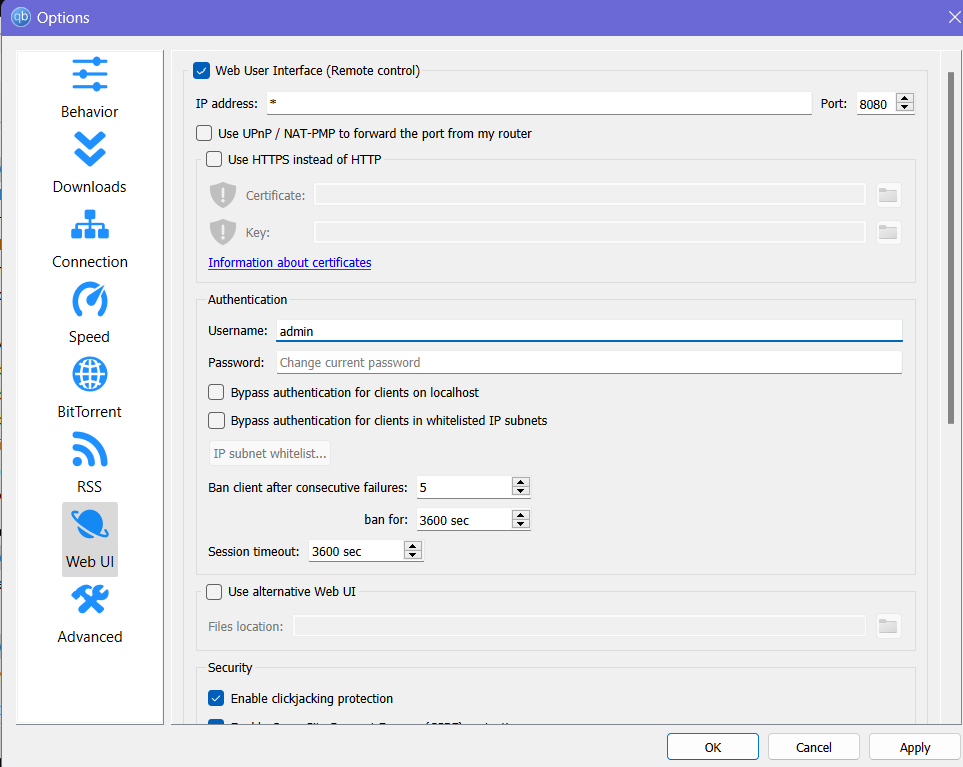
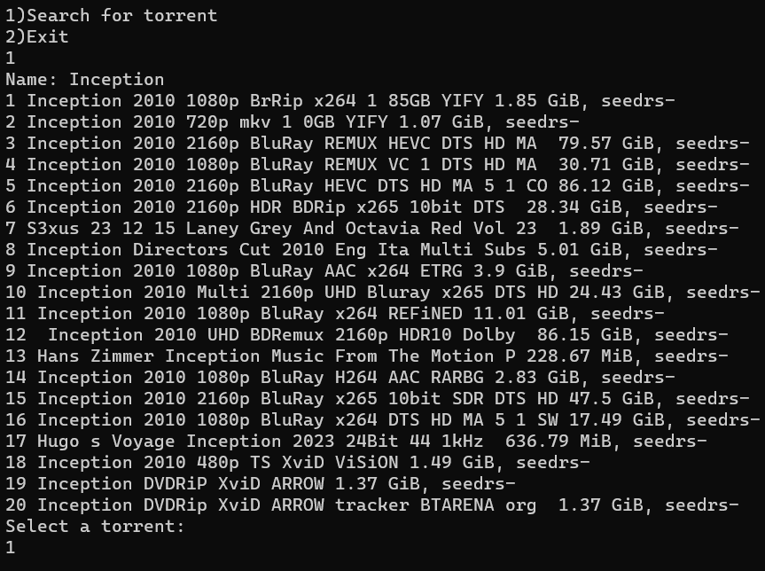

# Torrent Downloader CLI

A CLI agent for searching torrent and downloading it using qbittorrent.

## Getting Started
### Prerequisities
1. Python-3.6 or above
2. BeautifulSoup or bs4
3. pyperclip
4. requests
5. re
6. selenium
7. time
8. qbittorrent

### Installing
Clone or download it from github and install all the requirements. You can install them easily by this command `pip3 install requirements.txt` or install one by one.

### Setting up Qbittorent
Open the WebUI setting page on qbittorrent

1. Enable the Web User Interface(Remote Control) option.
2. Set the username and password(by default it will be set to admin).
3. Right click and open file `torrent_downloader.py` in your desired text editor, at line 7 replace the `admin` and `password` with the username and password you set.
4. Save the file.

### Setting up the output file
1. Right click and open file `main.py` in your desired text editor, at line 4 put your desired output directory between the `" "`.
2. Save the file.

### Screenshots

## License
This project is licensed under the [MIT License](LICENSE).

